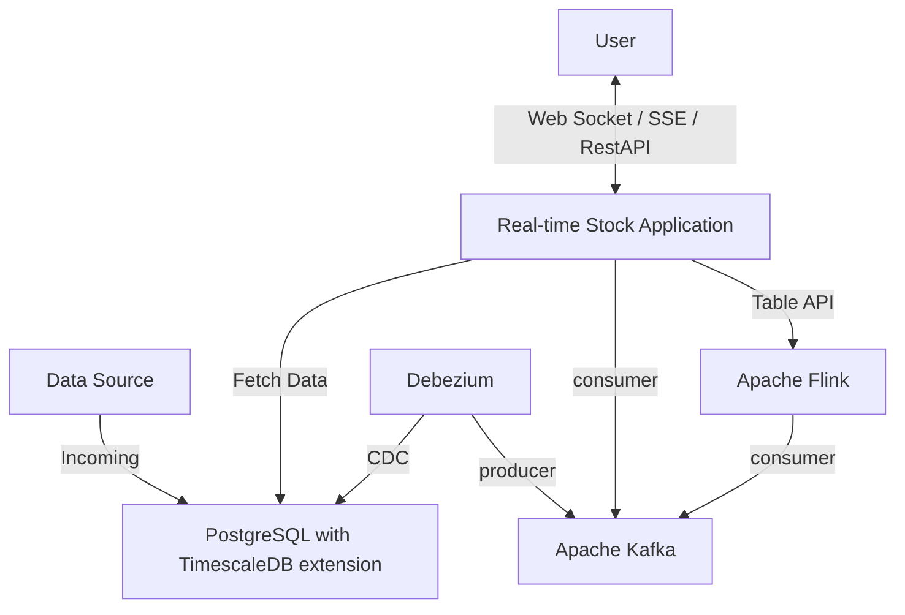

# 실시간 주식 거래 어플리케이션

## Goal
* 초당 수천건의 거래에 해당하는 주식거래 데이터를 사용자가 실시간 Tick 으로 볼 수 있음
* 실시간 거래 이상 내역을 확인 할 수 있음
* 지난 거래내역을 분/시간/일별로 조회 할 수 있음

## Architecture
### Overview

### Design Decisions
#### Why Event-Driven Architecture?
* 거래 데이터 생성, 저장, 분석, 알림이 각각 독립적으로 확장 가능하도록 구성
* 하나의 컴포넌트 장애가 전체 시스템에 미치는 영향을 최소화

#### Why Separate Real-time and Batch Processing?
* Real-time (WebSocket): 사용자가 즉시 거래 변화를 확인할 수 있도록
* Batch (REST API): 대용량 히스토리 데이터 조회 시 안정적인 성능 보장

#### Why CDC over Application-level Event Publishing?
* 데이터 정합성 보장: 트랜잭션 커밋과 동시에 이벤트 발행
* 기존 레거시 시스템 변경 최소화

## Tech Stack
* `FastAPI` - 0.115.12
    - 비동기 처리로 수천 건의 동시 IO 연결을 효율적으로 처리
* `PostgreSQL with TimescaleDB extension` - 16.9
    - 시계열 데이터 압축과 파티셔닝으로 대용량 거래 데이터의 저장/조회 성능을 최적화
* `Debezium`: 3.0.0.Final
    - 데이터베이스 변경사항을 실시간으로 캐치하여 애플리케이션 로직 수정 없이 CDC를 구현
* `Apache Kafka` - 4.0.0
    - 초당 수천 건의 거래 데이터를 버퍼링하고 여러 컨슈머가 독립적으로 처리할 수 있는 확장성
* `Apache Flink` - Scala 2.12
    - 스트리밍 데이터에서 실시간 이상 거래 탐지를 위한 복잡한 윈도우 기반 집계 연산을 처리

## How It Works
### Data Pipeline
1. Data Source 에서 PostgreSQL 에 거래내역 데이터를 저장한다
    - Data Source 라고 지칭하는 거래 데이터는 서비스 레벨에서 구현하여 모킹 함
    - `POST http://<HOST>/api/v1/stock/generate`
2. 저장된 거래내역은 Change Data Capture 를 통해 Kafka 로 스트리밍된다
3. Flink 에서는 거래내역을 실시간으로 통계 및 연산을 수행하여 이상 거래 여부를 판단한다
### User Interaction
* 사용자의 실시간 거래내역(Tick) 을 요청 시 서비스에서 WebSocket 연결을 하여 Kafka 의 메시지를 전달한다
    - `GET ws://<HOST>/api/v1/stock/realtime`
* 사용자의 거래 이상 거래 탐지 확인 요청 시 SSE 로 발생 내역을 전달한다
    - `GET http://<HOST>/api/v1/stock/anomaly`
* 지난 거래내역에 대한 조회 요청 시 RestAPI 로 제공한다
    - `GET http://<HOST>/api/v1/stock/search`