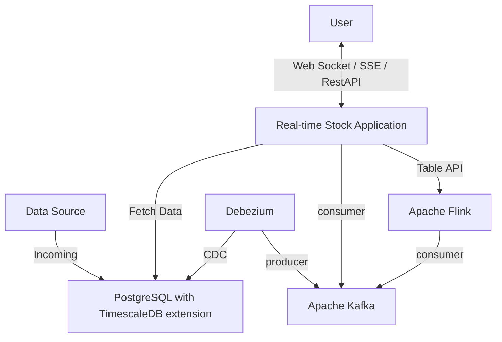

# 실시간 주식 거래 어플리케이션

## Goal

- 초당 수천건의 거래에 해당하는 주식거래 데이터를 사용자가 실시간 Tick 으로 볼 수 있음
- 실시간 거래 이상 내역을 확인 할 수 있음
- 지난 거래내역을 분/시간/일별로 조회 할 수 있음

## Architecture

### Overview

### Design Decisions

#### Why Event-Driven Architecture?

- 거래 데이터 생성, 저장, 분석, 알림이 각각 독립적으로 확장 가능하도록 구성
- 하나의 컴포넌트 장애가 전체 시스템에 미치는 영향을 최소화

#### Why Separate Real-time and Batch Processing?

- Real-time (WebSocket): 사용자가 즉시 거래 변화를 확인할 수 있도록
- Batch (REST API): 대용량 히스토리 데이터 조회 시 안정적인 성능 보장

#### Why CDC over Application-level Event Publishing?

- 데이터 정합성 보장: 트랜잭션 커밋과 동시에 이벤트 발행
- 기존 레거시 시스템 변경 최소화

## Tech Stack

- `FastAPI` - 0.115.12
  - 비동기 처리로 수천 건의 동시 IO 연결을 효율적으로 처리
- `PostgreSQL with TimescaleDB extension` - 16.9
  - 시계열 데이터 압축과 파티셔닝으로 대용량 거래 데이터의 저장/조회 성능을 최적화
- `Debezium`: 3.0.0.Final
  - 데이터베이스 변경사항을 실시간으로 캐치하여 애플리케이션 로직 수정 없이 CDC를 구현
- `Apache Kafka` - 4.0.0
  - 초당 수천 건의 거래 데이터를 버퍼링하고 여러 컨슈머가 독립적으로 처리할 수 있는 확장성
- `Apache Flink` - Scala 2.12
  - 스트리밍 데이터에서 실시간 이상 거래 탐지를 위한 복잡한 윈도우 기반 집계 연산을 처리

## How It Works

### Data Pipeline

1. Data Source 에서 PostgreSQL 에 거래내역 데이터를 저장한다
   - Data Source 라고 지칭하는 거래 데이터는 서비스 레벨에서 구현하여 모킹 함
   - `POST http://<HOST>/api/v1/stock/generate`
2. 저장된 거래내역은 Change Data Capture 를 통해 Kafka 로 스트리밍된다
3. Flink 에서는 거래내역을 실시간으로 통계 및 연산을 수행하여 이상 거래 여부를 판단한다

## 구현 기술 상세

### TimescaleDB: 시계열 데이터베이스 최적화

- **Hypertable**: `stock_trades` 테이블을 `event_time` 기준으로 Hypertable로 변환하여 시계열 데이터에 최적화된 파티셔닝을 자동 적용합니다. 이를 통해 대규모 데이터셋에서도 빠른 데이터 삽입 및 범위 기반 조회(Time-based queries) 성능을 보장합니다.
- **고성능 삽입**: 데이터 생성 시 `asyncpg`의 `copy_records_to_table` 메서드를 사용하여 PostgreSQL의 `COPY` 명령을 실행합니다. 이는 `INSERT`를 반복하는 것보다 훨씬 빠른 속도로 대량의 데이터를 벌크 삽입할 수 있게 해주는 핵심 기능입니다.

### Debezium & Kafka: 변경 데이터 캡처(CDC) 및 이벤트 스트리밍

- **CDC 설정**: Debezium PostgreSQL 커넥터가 `stock_trades` 테이블의 변경 사항을 실시간으로 감지합니다. `publication.name`으로 `dbz_publication`을 사용하여 논리적 디코딩(Logical Decoding)을 통해 변경분을 스트림으로 변환합니다.
- **Kafka 토픽**: 감지된 모든 데이터 변경(INSERT, UPDATE, DELETE) 이벤트는 `stock.stock_trades`라는 Kafka 토픽으로 발행(Publish)됩니다. 이 토픽은 실시간 데이터 파이프라인의 중심 허브 역할을 합니다.
- **느슨한 결합**: 이 아키텍처를 통해 데이터베이스와 실시간 처리 시스템(FastAPI, Flink)이 분리됩니다. 데이터베이스는 데이터 저장에만 집중하고, 실시간 처리가 필요한 모든 애플리케이션은 Kafka 토픽을 구독(Subscribe)하여 독립적으로 확장 및 운영될 수 있습니다.

## API

### Tick

- `GET ws://<HOST>/api/v1/stock/real-time`
  - Description: 사용자의 실시간 거래내역(Tick) 을 요청 시 서비스에서 WebSocket 연결을 하여 Kafka 의 메시지를 전달한다
  - Features
    - [ ] TBD

### Anomaly

- `GET http://<HOST>/api/v1/stock/anomaly`
  - Description: 사용자의 거래 이상 거래 탐지 확인 요청 시 SSE 로 발생 내역을 전달한다
  - Features
    - [ ] TBD

### Trades

- `GET http://<HOST>/api/v1/stock`
  - Description: 지난 거래내역에 대한 조회 요청 시 RestAPI 로 제공한다
  - Features
    - [ ] TBD
